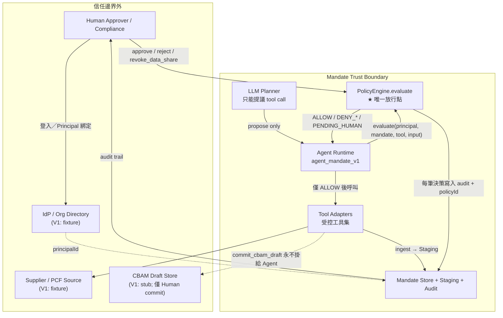

# Mandate — Trust Architecture

**文件狀態**：V1 規格（評審對照／程式契約）  
**產品**：Mandate（CBAM／嵌入排放 碳數據信任閘門 Agent）  
**對齊**：可信 AI 黑客松六信任要點  
**語言**：繁體中文為主；識別子、決策碼、欄位名維持英文

---

## 1. 產品一句話

**Mandate** 是碳數據流程上的**信任閘門 Agent**：在已授權的 Mandate 邊界內，代買方向供應商索取實際嵌入排放（PCF）、經品質閘入庫、提議寫入 CBAM 申報草稿；**從不自行 commit 高風險寫入**——唯一放行點是 `PolicyEngine.evaluate`，且 `commit_cbam_draft` 永不暴露給 Agent。分享撤銷後，該批數據不可再用於申報。

> **不做**真 CBAM registry、碳權避險、儀表板產品主軸。

---

## 2. 信任邊界圖



### 2.1 邊界內外責任

| 區域 | 可做 | 不可做 |
|------|------|--------|
| LLM Planner | 提議 `toolName` + 參數草稿 | 直接呼叫工具、覆寫 policy、略過 audit |
| Agent Runtime | 組裝評估請求、執行已 ALLOW 的 tool、回寫結果 | 自行判定高風險放行、呼叫未註冊工具 |
| PolicyEngine | 依 status → deny → allow → constraints → HITL 決策 | 執行副作用（不得 commit 草稿、不得改供應商主檔） |
| Tool Adapters | 在契約內讀寫 stub／fixture／Staging | 暴露 `commit_cbam_draft` 給 Agent 工具表 |
| 邊界外 Human | 核准 PENDING、撤銷資料分享、觸發 commit（Human UI） | 被 Agent 代簽高風險寫入 |

### 2.2 核心原則（不可違反）

1. **LLM 只能提議 tool**；提議 ≠ 授權。  
2. **唯一放行點**：`PolicyEngine.evaluate(...)`。任何 tool 執行前必須拿到非 `DENY_*` 且（若需 HITL）已有對應 `Approval`。  
3. **每個 AuditEvent 必須帶 `policyId`**。  
4. **deny 優先於 allow**。  
5. **`submit_cbam_draft` 一律 `PENDING_HUMAN`**（`POL-HITL-010`）。  
6. **`commit_cbam_draft` 永不暴露給 Agent**（僅 Human／後端簽核通道）。  
7. **PCF 缺品質最低欄位 → `DENY_CONSTRAINT`**（`POL-CARB-001`）。  
8. **資料分享撤銷後不可再用**（`POL-REV-010`）；Mandate 撤銷後不可自行恢復（須發新 Mandate）。

---

## 3. 六信任要點索引表

| # | 要點 | 英文 | Mandate 落點 | 主要文件 | 代表 policyId / 識別子 |
|---|------|------|--------------|----------|------------------------|
| 1 | 主體／代表誰 | Principal | `Principal` + Mandate 綁定 `orgId`／`userId`／`agentId` | [DATA_MODEL.md](./DATA_MODEL.md) | `principalId` |
| 2 | 授權 | Authorization | Mandate 狀態、allow／deny、資料分享範圍與期限 | [POLICY_SPEC.md](./POLICY_SPEC.md)、[PERMISSION_MATRIX.md](./PERMISSION_MATRIX.md) | `POL-AUTH-001` … `POL-AUTH-003` |
| 3 | 工具與動作 | Tool / Action | 受控工具表與風險級 L1–L4 | [PERMISSION_MATRIX.md](./PERMISSION_MATRIX.md) | `request_emissions` 等 |
| 4 | 政策閘門 | Policy Gate | `PolicyEngine.evaluate` 六段評估序 | [POLICY_SPEC.md](./POLICY_SPEC.md) | `POL-CARB-001`、`POL-HITL-010` |
| 5 | 稽核軌跡 | Audit Log | `AuditEvent` 必含 `policyId`、decision、actor | [DATA_MODEL.md](./DATA_MODEL.md) | 每筆 evaluate 寫入 |
| 6 | 失效／撤銷 | Expiry / Revocation | Mandate 撤銷／過期；**資料分享撤銷後不可用** | [POLICY_SPEC.md](./POLICY_SPEC.md) | `POL-AUTH-001`、`POL-REV-010` |

交件一頁版：[GOVERNANCE_GAP_MEMO.md](./GOVERNANCE_GAP_MEMO.md)  
威脅與缺口：[THREAT_AND_GAPS.md](./THREAT_AND_GAPS.md)

---

## 4. 執行時序（契約級）

```text
1. Human / System 建立 Mandate（ACTIVE, not expired）
2. User 下達碳數據意圖 → LLM 產出 proposed tool call
3. Runtime 呼叫 PolicyEngine.evaluate(ctx)
4. Engine 依 POLICY_SPEC 順序評估，寫 AuditEvent{ policyId, decision, ... }
5a. DENY_*     → 回傳理由，不呼叫 tool
5b. PENDING_HUMAN → 建立 Approval(PENDING)；等待 Human
5c. ALLOW      → 呼叫 tool adapter；結果再寫 audit（同一 correlationId）
6. ingest_pcf_payload：缺品質欄位 → POL-CARB-001 DENY_CONSTRAINT
7. submit_cbam_draft：步驟 5 必為 PENDING_HUMAN（POL-HITL-010）
8. Human 核准後：一次性 Approval 消耗；僅 Human 通道可觸發 commit_cbam_draft
9. revoke_data_share → shareRevoked；之後再用該 payload → POL-REV-010
10. revoke mandate → status=REVOKED；作廢 PENDING；之後 evaluate 全 DENY_REVOKED
```

### 4.1 `evaluate` 輸入／輸出契約（摘要）

**Input（邏輯）**

| 欄位 | 說明 |
|------|------|
| `principal` | 發起方身份 |
| `actor` | 實際呼叫者（Human / Agent / System） |
| `mandateId` | 授權憑據 |
| `toolName` | 提議的工具 |
| `input` | 工具參數（PCF、supplierId、draft 等） |
| `now` | 評估時刻（測試可注入） |

**Output（邏輯）**

| 欄位 | 說明 |
|------|------|
| `decision` | `ALLOW` \| `DENY_REVOKED` \| `DENY_EXPIRED` \| `DENY_POLICY` \| `DENY_CONSTRAINT` \| `PENDING_HUMAN` |
| `policyId` | 終止決策的政策 ID |
| `reason` | 人類可讀理由 |
| `approvalId` | 若 PENDING／已綁定核准 |
| `auditEventId` | 對應稽核列 |

完整欄位見 [DATA_MODEL.md](./DATA_MODEL.md)；決策碼與 IF/THEN 見 [POLICY_SPEC.md](./POLICY_SPEC.md)。

---

## 5. 與「碳」的邊界聲明

| 做 | 不做 |
|----|------|
| 嵌入排放／PCF 品質閘（最低欄位） | 碳權買賣、避險、碳費套利 |
| CBAM **草稿**寫入的 HITL 與 audit | 真 CBAM registry／官方申報 API |
| 資料分享撤銷後不可再用 | 儀表板／可視化產品主軸 |
| fixture 演示拒收漂亮噸數 | 完整第三方 PCF 核算引擎 |

此聲明同時約束產品敘事與 Demo 腳本。

---

## 6. 為何這不是多 Agent 編排（`feature/trust-enhancements` 分支，2026-08-17）

`server/llm.js` 的 `proposeCarbon()`／`proposeAuth()` 是兩個固定角色的 LLM 呼叫（CarbonDataAgent／AuthAgent），目的是資訊最小化——不同領域的資料只給需要它的那個角色看。這條刻意偏離 `DECISIONS.md` §7「V1 不做：多 Agent 編排」（詳見 `mandate/CLAUDE.md`「本分支對 `DECISIONS.md` §7 的偏離」一節，含決策者、範圍、理由）。以下說明為什麼「LLM 不自行決定權限」這個核心保證沒有被動搖：

1. **分工是程式寫死的，不是動態編排**：`server/agent.js` 的 `runAgentTurn()` 每輪固定呼叫這兩個角色，沒有任何第三個 LLM 在中間決定「這輪該給誰處理」。沒有 orchestrator、沒有 agent-to-agent 協商、沒有動態產生新角色。
2. **AuthAgent 結構上不可能提議工具**：`llm.js` 的 `AUTH_ALLOWED_TOOLS` 是空集合，`proposeAuth()` 回傳前一律用這個空白名單過濾——即使模型硬要提議工具也會被程式擋掉，不是靠 prompt 拜託。它唯一能做的只有回文字問答。
3. **CarbonDataAgent 沿用今天既有的白名單**：`CARBON_ALLOWED_TOOLS` 跟改動前的 `ALLOWED_PROPOSE` 完全相同（4 個工具），沒有擴權。
4. **兩者共用同一個 `server/policy.js` 放行點**：任何一方提議的工具，都要經過 `invokeTool()` → `policy.js` 的六步驟評估才會真正執行；沒有新的放行路徑，也沒有為多 Agent 架構新增任何 policyId 或例外通道。
5. **已知限制（誠實揭露）**：兩個角色雖然各自只拿到自己領域的**結構化 context**（供應商／staging vs. mandate／稽核摘要），但共用同一份**對話歷史文字**（`agentSession` 的 user/assistant 紀錄）。如果先前對話文字裡提過碳數據細節，AuthAgent 理論上讀得到那段文字——這不是正式的跨 Agent 資訊流控制，只是把「每次呼叫時餵給模型的結構化資料」做了範圍限制。對本 PoC 的示範目的已足夠，但不要對外宣稱這是完整的資訊流隔離。

---

## 7. 文件地圖

| 檔案 | 角色 |
|------|------|
| 本檔 `TRUST_ARCHITECTURE.md` | 總覽、邊界、原則、六要點索引 |
| `PERMISSION_MATRIX.md` | Principal／Actor／Agent 與完整工具權限表 |
| `POLICY_SPEC.md` | 評估順序與穩定 policyId 契約 |
| `DATA_MODEL.md` | Mandate／PcfPayload／Staging／CbamDraft／Audit |
| `GOVERNANCE_GAP_MEMO.md` | 交件一頁：六要點 × Demo × 缺口 |
| `THREAT_AND_GAPS.md` | 威脅模型與上線路徑 |

---

## 8. 版本

| 版本 | 日期 | 說明 |
|------|------|------|
| V1 | 2026-07-20 | 碳數據信任閘門契約（由採購閘改題） |
| V1.1 | 2026-08-17 | 新增第 6 節「為何這不是多 Agent 編排」，個人 fork 準備期強化，尚未併回 `1qaz0726-star/mandate:main` |
